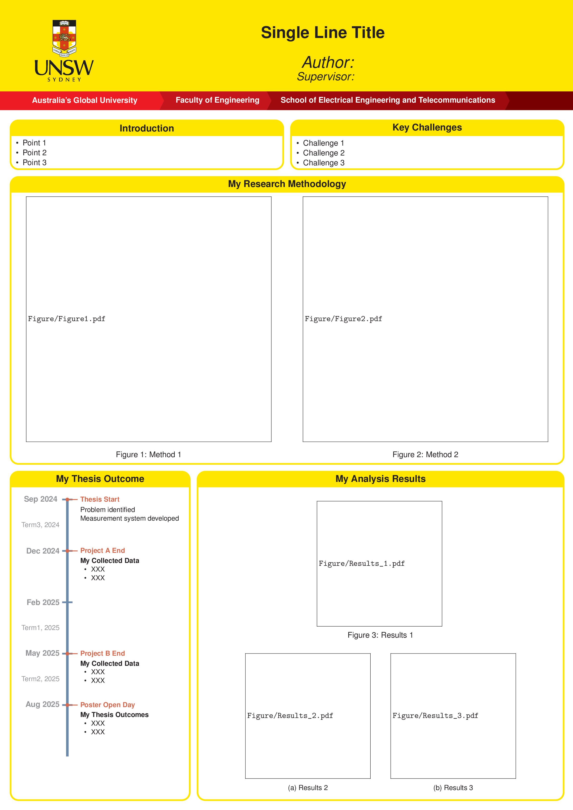

# UNSW-EE-Poster-LaTeX-Template

## Usage

1. Click `Use this template` at the top right corner, then select `Create a new repository`.
2. Enter a `Repository name` and, if desired, a `Description`.
3. Set the repository visibility to `Public` (default) or `Private`.
4. Click `Create repository`.
5. Clone your repository into your preferred editor, or import it into `Overleaf` (recommended).

## About This Template

This is a basic poster template for UNSW EE students.

It is based on the `baposter` class, which is a LaTeX class for creating posters.

### Example

